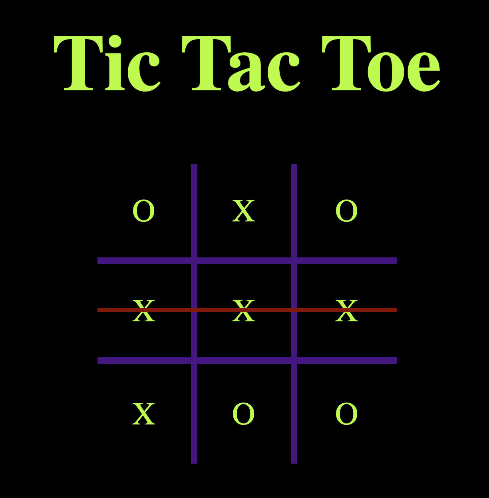

# 🎮 Tic Tac Toe Game

A simple and interactive **Tic Tac Toe** game built using **HTML, CSS, and JavaScript**. This project demonstrates core front-end development concepts such as DOM manipulation, event handling, game logic, and responsive design.

---

## ✨ Features

- 2-player mode (X vs O)
- Win, draw, and reset detection
- Highlighting winning combinations
- Responsive design for desktop and mobile
- Clean and intuitive UI

---

## 💻 Technologies Used

- **HTML** – Structure of the game board  
- **CSS** – Styling and layout  
- **JavaScript** – Game logic and interactivity  

---

## 📷 Preview

  
